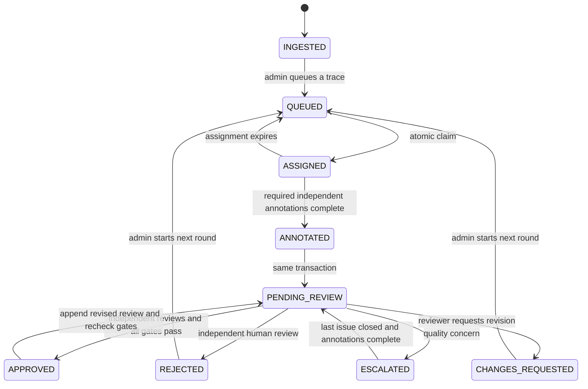
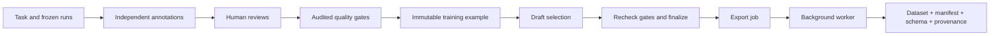

# ARGUS architecture

ARGUS treats human annotation as an auditable data production workflow. Phase 2 extends ingestion and annotation with independent multi-annotator review, gold calibration, auditable quality gates, immutable training snapshots, dataset versions, lineage, and background RL-format exports. External object storage and monitoring integrations remain future work.

## Boundaries

- `backend/app/api`: HTTP transport, request validation, dependencies, RBAC.
- `schemas`: bounded Pydantic input contracts, including ordered trajectory validation.
- `auth`: Argon2 password hashing and signed, expiring JWT access tokens.
- `repositories`: tenant-scoped object lookup, aggregate counts, safe serialization.
- `services`: ingestion idempotency, state transitions, assignment recovery, audit creation.
- `models` and `db`: SQLAlchemy persistence and transaction lifetime.
- `queue`: Redis sorted-set coordination with database fallback.
- `frontend`: React Router pages, typed API client, TanStack Query server state, reusable UI primitives, Tailwind and a shared CSS design system.

API dependencies share one SQLAlchemy session per request. Changes and their audit events commit together; failures roll back. Explicit commits before Redis updates ensure the cache never becomes authoritative. No external LLM service or paid API is needed.

## Tenancy and authorization

Public registration creates a **new** organization and its first admin. Registration cannot select an existing organization or assign itself a role there. Existing admins provision members through `POST /users`; users cannot self-promote. Every project/task lookup scopes through the authenticated user's organization. Annotators can inspect only tasks they have been assigned; reviewers can inspect workspace tasks and annotations. Aggregate operational counts and workspace member names are visible to all workspace members.

JWT validation requires subject, expiration, issue time, issuer, audience, and HS256. Authorization reads the current user from the database rather than trusting a role claim. Passwords use Argon2. The web client stores the access token in session storage, expires it with the browser session, and sends it only to the same-origin API. Tokens have an eight-hour default lifetime; there is no refresh-token or external SSO flow in Phase 1. Public production deployments should add TLS, account verification/invites, edge rate limiting, secret management, and token revocation/SSO appropriate to the deployment. Compose binds host ports only to localhost.

## Relational invariants

UUID strings are stable identifiers. PostgreSQL uses JSONB for task payloads, run metadata, tool inputs/outputs, annotation structures, and audit payloads. The migration uses real enums and explicit foreign keys, check constraints, and indexes. Task external IDs are unique within each project. Trajectory sequence numbers are unique within each run. Only one annotation exists per assignment. A partial unique index permits only one active assignment per (task, annotator, round). Task row locks enforce the total configured slot capacity; user row locks serialize duplicate claims.

Project deletion cascades through unprotected tasks, runs, steps, assignments, and annotations. Projects containing training examples, preference decisions, or gold attempts return 409: retained evidence must survive. Audit rows survive project/task deletion with nullable references and a deletion event containing the former project ID and name. User references on annotations/assignments restrict deletion to preserve provenance. There is no user-deletion endpoint in Phase 1.

## Workflow

Every transition is validated in one service and creates an audit event. Completion never approves an example. Only an admin/reviewer who has not annotated the task can approve/reject, and a rationale is required. Completed annotations and queued trajectories are immutable. Reannotation creates a new assignment and annotation, retaining the earlier attempt.

## Queue and failure semantics

PostgreSQL is authoritative. Claims lock the requesting user to serialize duplicate requests by the same person, then select a queued or partially assigned task with remaining annotation slots with `FOR UPDATE SKIP LOCKED`, ordered by descending priority and creation time. Assignment insertion, task transition, and audit records commit atomically. The partial unique index provides an additional database guard against duplicate active ownership.

Redis holds one priority sorted set per organization. Enqueue mirrors a committed task; claim uses atomic `ZPOPMAX` to obtain a priority hint. PostgreSQL checks **all** eligible tasks at or above that hint, not merely the cached task, so uncached higher-priority work remains eligible. Empty/stale hints fall back to the full indexed database query. Project-filtered requests query PostgreSQL directly. Redis downtime, eviction, rollback, or a crash between commit and cache update does not lose work. Cached cardinality is advisory; dashboard length comes from PostgreSQL.

Lease duration defaults to 60 minutes from assignment. On each claim request, expired active assignments in the organization are marked EXPIRED and their tasks requeued, under task row locks. Active mutations reject expired leases even before recovery runs. A user resumes their existing active assignment before receiving new work, even if the project selector changes. Phase 1 recovery is demand-driven, not a background scheduler; an idle queue recovers when the next claim arrives. Historical draft annotations remain associated with their expired assignment.

## Ingestion and transaction boundaries

A project row lock serializes task ingestion within a project. Repeating an external ID with identical task content returns the existing task. Reusing it with different content returns 409. Batch ingestion is all-or-nothing and bounded to 100 tasks. Agent runs accept at most 1,000 strictly ordered steps with unique sequence numbers and timezone-aware timestamps. Once queued, a trace cannot be changed underneath an annotator. Run ingestion is not idempotent; callers should avoid retrying a successful run upload without checking the trajectory first.

## UX and data

The dashboard queries real counts, recent audit events, Redis connectivity, and seven-day completed-assignment throughput. There are no simulated operational metrics. Demo records are explicit, reproducible seed data, created through the same ingestion and transition services. Every run has messages, a tool call/result, an observation, and a final answer. Task exploration supports pagination, search, status/priority filters, and sorting. The annotation editor rejects invalid structured JSON, saves drafts, blocks submission of unsaved changes, and submits to review.

The dataset placeholder is replaced by curation, immutable versions, lineage, and export history. Monitoring remains a future integration.

## Verification

Fast API tests use isolated SQLite databases for portable behavior checks, with foreign keys enabled; this does **not** verify PostgreSQL locking. The PostgreSQL integration suite uses a dedicated test database, real transactions, and simultaneous claim requests. Migration upgrade/downgrade checks and Compose health checks cover infrastructure configuration. Frontend tests cover table controls and annotation save/submit behavior; the browser smoke script exercises the real seeded application.

## Phase 2 data and service boundaries

`annotation_schema` publishes append-only schema versions. Queueing pins a version and required annotation count to a task round. Reference tasks keep the schema pinned when their expected answers were defined. Dynamic values are validated on save and completion. The baseline outcome and 1–5 score remain available for consistent cross-project analytics and reward normalization.

`consensus` calculates categorical pair agreement, per-field disagreement, and numeric mean/median/population variance. Cohort Cohen/Fleiss kappa is calculated only where the rater/task structure permits it; undefined values stay null. `review` records new rows for every decision, including revisions, binding each to the exact current-round annotation IDs. An author of any annotation on the task cannot review it. Rejected/requested-change tasks can be queued into a new round without deleting prior evidence.

`quality_gate` evaluates current policy against completed independent annotations, exact human review evidence, score/agreement/variance thresholds, unresolved escalations, and rolling reference performance. Every call persists a result and audit event, including failures. Required reviews cannot be configured below one. The latest decision per reviewer counts; a current rejection/request for changes vetoes eligibility. A gold reference never becomes a training example.

`datasets` creates a self-contained snapshot only after a fresh successful gate evaluation. Finalization locks project policies and tasks in deterministic order, then checks gates and exact source annotation/review identities again. The selected snapshots, filters, metadata, and finalization evidence determine a SHA-256 checksum. PostgreSQL triggers reject updates/deletes of training snapshots and finalized versions, and changes to finalized membership. Foreign keys retain original sources; APIs expose frozen lineage as well as links to live tasks. A future policy or review revision can block new dataset versions without rewriting historical finalized artifacts.

`export_jobs` persists jobs before notifying Redis. A separate worker consumes wakeups and scans PostgreSQL when Redis is unavailable. It claims pending/stale jobs with `SKIP LOCKED`, holds a job row lock during generation, streams data rows to a temporary file, and atomically replaces the data artifact. Abandoned RUNNING jobs are eligible for recovery after 15 minutes; active workers retain their lock and are skipped. Downloads require COMPLETED status and tenant authorization. Format incompatibility fails the job explicitly; partial files cannot be downloaded. All artifacts live in a shared named volume mounted by API and worker. The provenance list currently uses memory proportional to the example count.

See [quality-control.md](quality-control.md) for definitions, state transitions, and calibration limitations, and [datasets.md](datasets.md) for format and reproducibility contracts.
